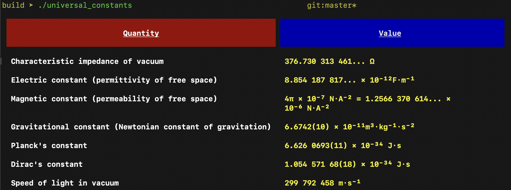
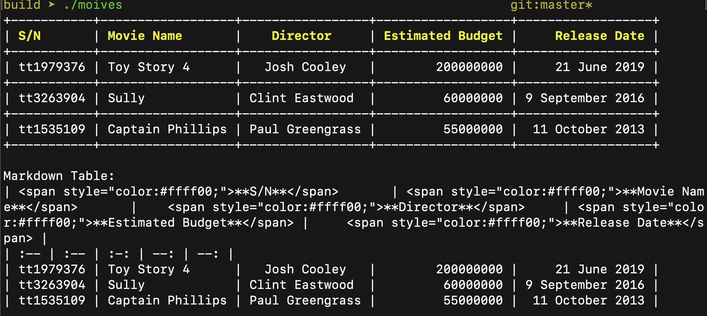

# tabulate

[](https://github.com/vxfury/tabulate/blob/master/LICENSE)
[](https://github.com/vxfury/tabulate/actions)
[](https://codecov.io/gh/vxfury/tabulate)

[](https://github.com/vxfury/tabulate/pulls)


Source for the above image can be found [here](https://github.com/vxfury/tabulate/blob/master/samples/summary.cc)

## Table of Contents

- [tabulate](#tabulate)
  - [Table of Contents](#table-of-contents)
  - [Quick Start](#quick-start)
  - [Formatting Options](#formatting-options)
    - [Word Wrapping](#word-wrapping)
    - [Font Alignment](#font-alignment)
    - [Font Styles](#font-styles)
    - [Cell Colors](#cell-colors)
    - [Borders and Corners](#borders-and-corners)
    - [Range-based Iteration](#range-based-iteration)
    - [Nested Tables](#nested-tables)
    - [UTF-8 Support](#utf-8-support)
  - [Exporters](#exporters)
    - [Markdown](#markdown)
  - [Building Samples](#building-samples)
  - [Contributing](#contributing)
  - [License](#license)

## Quick Start

`tabulate` is a header-only library. Just add `include/` to your `include_directories` and you should be good to go. A single header file version is also available in `single_include/`.

**NOTE** Tabulate supports `>=C++11`. The rest of this README, however, assumes `C++17` support.

Create a `Table` object and call `Table.add_rows` to add rows to your table.

```cpp
#include "tabulate.h"

using namespace tabulate;

int main()
{
    Table universal_constants;

    universal_constants.add("Quantity", "Value");
    universal_constants.add("Characteristic impedance of vacuum", "376.730 313 461... Ω");
    universal_constants.add("Electric constant (permittivity of free space)", "8.854 187 817... × 10⁻¹²F·m⁻¹");
    universal_constants.add("Magnetic constant (permeability of free space)",
                            "4π × 10⁻⁷ N·A⁻² = 1.2566 370 614... × 10⁻⁶ N·A⁻²");
    universal_constants.add("Gravitational constant (Newtonian constant of gravitation)",
                            "6.6742(10) × 10⁻¹¹m³·kg⁻¹·s⁻²");
    universal_constants.add("Planck's constant", "6.626 0693(11) × 10⁻³⁴ J·s");
    universal_constants.add("Dirac's constant", "1.054 571 68(18) × 10⁻³⁴ J·s");
    universal_constants.add("Speed of light in vacuum", "299 792 458 m·s⁻¹");
```

You can format this table using `Table.format()` which returns a `Format` object. Using a fluent interface, format properties of the table, e.g., borders, font styles, colors etc.

```cpp
universal_constants.format()
        .styles(Style::bold)
        .border_top(" ")
        .border_bottom(" ")
        .border_left(" ")
        .border_right(" ")
        .corner(" ");
```

You can access rows in the table using `Table[row_index]`. This will return a `Row` object on which you can similarly call `Row.format()` to format properties of all the cells in that row.

Now, let's format the header of the table. The following code changes the font background of the header row to `red`, aligns the cell contents to `center` and applies a padding to the top and bottom of the row.

```cpp
    universal_constants[0]
        .format()
        .border_top_padding(1)
        .border_bottom_padding(1)
        .align(Align::center)
        .styles(Style::underline)
        .background_color(Color::red);
```

Calling `Table.column(index)` will return a `Column` object. Similar to rows, you can use `Column.format()` to format all the cells in that column.

Now, let's change the font color of the second column to yellow:

```cpp
    universal_constants.column(1).format().color(Color::yellow);
}
```

You can access cells by indexing twice from a table: From a row using `Table[row_index][col_index]` or from a column using `Table.column(col_index)[cell_index]`. Just like rows, columns, and tables, you can use `Cell.format()` to format individual cells

```cpp
    universal_constants[0][1].format().background_color(Color::blue).color(Color::white);

    std::cout << universal_constants.xterm() << std::endl;
}
```



## Formatting Options

### Word Wrapping

`tabulate` supports automatic word-wrapping when printing cells.

Although word-wrapping is automatic, there is a simple override. Automatic word-wrapping is used only if the cell contents do not have any embedded newline `\n` characters. So, you can embed newline characters in the cell contents and enforce the word-wrapping manually.

```cpp
#include "tabulate.h"
using namespace tabulate;

int main()
{
    Table table;

    table.add("This paragraph contains a veryveryveryveryveryverylong word. The long word will "
              "break and word wrap to the next line.",
              "This paragraph \nhas embedded '\\n' \ncharacters and\n will break\n exactly "
              "where\n you want it\n to\n break.");

    table[0][0].format().width(20);
    table[0][1].format().width(50);

    std::cout << table.xterm() << std::endl;
}
```

*  The above table has 1 row and 2 columns.
*  The first cell has automatic word-wrapping.
*  The second cell uses the embedded newline characters in the cell contents - even though the second column has plenty of space (50 characters width), it uses user-provided newline characters to break into new lines and enforce the cell style.
*  **NOTE**: Whether word-wrapping is automatic or not, `tabulate` performs a trim operation on each line of each cell to remove whitespace characters from either side of line.


**NOTE**: Both columns in the above table are left-aligned by default. This, however, can be easily changed.

### Font Alignment

`tabulate` supports three font alignment settings: `left`, `center`, and `right`. By default, all table content is left-aligned. To align cells, use `.format().align(alignment)`.

```cpp
#include "tabulate.h"
using namespace tabulate;

int main()
{
    tabulate::Table movies;

    movies.add("S/N", "Movie Name", "Director", "Estimated Budget", "Release Date");
    movies.add("tt1979376", "Toy Story 4", "Josh Cooley", 200000000, "21 June 2019");
    movies.add("tt3263904", "Sully", "Clint Eastwood", 60000000, "9 September 2016");
    movies.add("tt1535109", "Captain Phillips", "Paul Greengrass", 55000000, " 11 October 2013");

    // center align 'Director' column
    movies.column(2).format().align(Align::center);

    // right align 'Estimated Budget' column
    movies.column(3).format().align(Align::right);

    // right align 'Release Date' column
    movies.column(4).format().align(Align::right);

    // Color header cells
    for (size_t i = 0; i < movies.column_size(); ++i) {
        movies[0][i].format().color(Color::yellow).styles(Style::bold);
    }

    std::cout << movies.xterm() << std::endl;
    std::cout << "Markdown Table:\n" << movies.markdown() << std::endl;
}
```


### Font Styles

`tabulate` supports 8 font styles: `bold`, `dark`, `italic`, `underline`, `blink`, `reverse`, `concealed`, `crossed`. Depending on the terminal (or terminal settings), some of these might not work.

To apply a font style, simply call `.format().font_style({...})`. The `font_style` method takes a vector of font styles. This allows to apply multiple font styles to a cell, e.g., ***bold and italic***.

```cpp
#include "tabulate.h"

using namespace tabulate;

int main()
{
    Table table;
    table.add("Bold", "Italic", "Bold & Italic", "Blinking");
    table.add("Underline", "Crossed", "faint", "Bold, Italic & Underlined");
    table.add("Doubly Underline", "Invisable", "", "");

    table[0][0].format().styles(Style::bold);

    table[0][1].format().styles(Style::italic);

    table[0][2].format().styles(Style::bold, Style::italic);

    table[0][3].format().styles(Style::blink);

    table[1][0].format().styles(Style::underline);

    table[1][1].format().styles(Style::crossed);

    table[1][2].format().styles(Style::faint);

    table[1][3].format().styles(Style::bold, Style::italic, Style::underline);

    table[2][0].format().styles(Style::doubly_underline);
    table[2][1].format().styles(Style::invisible);

    std::cout << table.xterm() << std::endl;
    // std::cout << "Markdown Table:\n" << table.markdown() << std::endl;
}
```


**NOTE**: Font styles are applied to the entire cell. Unlike HTML, you cannot currently apply styles to specific words in a cell.

### Cell Colors

There are a number of methods in the `Format` object to color cells - foreground and background - for font, borders, corners, and column separators. `tabulate` supports 8 colors: `grey`, `red`, `green`, `yellow`, `blue`, `magenta`, `cyan`, and `white`, and support **True Color** if possiable. The look of these colors vary depending on your terminal.

For font, border, and corners, you can call `.format().<element>_color(value)` to set the foreground color and `.format().<element>_background_color(value)` to set the background color. Here's an example:

```cpp
#include "tabulate.h"

using namespace tabulate;

int main()
{
    Table colors;

    colors.add("Font Color is Red", "Font Color is Blue", "Font Color is Green");
    colors.add("Everything is Red", "Everything is Blue", "Everything is Green");
    colors.add("Font Background is Red", "Font Background is Blue", "Font Background is Green");

    colors[0][0].format().color(Color::red).styles(Style::bold);
    colors[0][1].format().color(Color::blue).styles(Style::bold);
    colors[0][2].format().color(Color::green).styles(Style::bold);

    colors[1][0]
        .format()
        .border_left_color(Color::red)
        .border_left_background_color(Color::red)
        .background_color(Color::red)
        .color(Color::red)
        .border_right_color(Color::blue)
        .border_right_background_color(Color::blue);

    colors[1][1]
        .format()
        .background_color(Color::blue)
        .color(Color::blue)
        .border_right_color(Color::green)
        .border_right_background_color(Color::green);

    colors[1][2]
        .format()
        .background_color(Color::green)
        .color(Color::green)
        .border_right_color(Color::green)
        .border_right_background_color(Color::green);

    colors[2][0].format().background_color(Color::red).styles(Style::bold);
    colors[2][1].format().background_color(Color::blue).styles(Style::bold);
    colors[2][2].format().background_color(Color::green).styles(Style::bold);

    std::cout << colors.xterm() << std::endl;
    // std::cout << "Markdown Table:\n" << colors.markdown() << std::endl;
}
```


### Borders and Corners

`tabulate` allows for fine control over borders and corners. For each border and corner, you can set the text, color, and background color.

**NOTE**: You can use `.corner(..)`, `.corner_color(..)`, and `.corner_background_color(..)` to set a common style for all corners. Similarly, you can use `.border(..)`, `.border_color(..)` and `.border_background_color(..)` to set a common style for all borders.

**NOTE**: Note the use of `.format().multi_bytes_character(true)`. Use this when you know your table has multi-byte characters. This is an opt-in because the calculation of column width when dealing with multi-byte characters is more involved and you don't want to pay the performance penalty unless you need it. Just like any other format setting, you can set this at the table-level, row-level, or on a per-cell basis.

Here's an example where each border and corner is individually styled:

```cpp
#include "tabulate.h"

using namespace tabulate;

int main()
{
    Table table;

    table.add("ᛏᚺᛁᛊ ᛁᛊ ᚨ ᛊᛏᛟᚱy ᛟᚠᚨ ᛒᛖᚨᚱ ᚨᚾᛞ\n"
              "ᚨ ᚹᛟᛚᚠ, ᚹᚺᛟ ᚹᚨᚾᛞᛖᚱᛖᛞ ᛏᚺᛖ\n"
              "ᚱᛖᚨᛚᛗᛊ ᚾᛁᚾᛖ ᛏᛟ ᚠᚢᛚᚠᛁᛚᛚ ᚨ ᛈᚱᛟᛗᛁᛊᛖ\n"
              "ᛏᛟ ᛟᚾᛖ ᛒᛖᚠᛟᚱᛖ; ᛏᚺᛖy ᚹᚨᛚᚲ ᛏᚺᛖ\n"
              "ᛏᚹᛁᛚᛁᚷᚺᛏ ᛈᚨᛏᚺ, ᛞᛖᛊᛏᛁᚾᛖᛞ ᛏᛟ\n"
              "ᛞᛁᛊcᛟᚹᛖᚱ ᛏᚺᛖ ᛏᚱᚢᛏᚺ\nᛏᚺᚨᛏ ᛁᛊ ᛏᛟ cᛟᛗᛖ.");

    table[0][0]
        .format()
        .multi_bytes_character(true)
        // Font styling
        .styles(Style::bold, Style::faint)
        .align(Align::center)
        .color(Color::red)
        .background_color(Color::yellow)
        // Corners
        .corner_top_left("ᛰ")
        .corner_top_right("ᛯ")
        .corner_bottom_left("ᛮ")
        .corner_bottom_right("ᛸ")
        .corner_top_left_color(Color::cyan)
        .corner_top_right_color(Color::yellow)
        .corner_bottom_left_color(Color::green)
        .corner_bottom_right_color(Color::red)
        // Borders
        .border_top("ᛜ")
        .border_bottom("ᛜ")
        .border_left("ᚿ")
        .border_right("ᛆ")
        .border_left_color(Color::yellow)
        .border_right_color(Color::green)
        .border_top_color(Color::cyan)
        .border_bottom_color(Color::red);

    std::cout << table.xterm() << std::endl;
}
```


### Range-based Iteration

Hand-picking and formatting cells using `operator[]` gets tedious very quickly. To ease this, `tabulate` supports range-based iteration on tables, rows, and columns. Quickly iterate over rows and columns to format cells.

```cpp
#include "tabulate.h"
using namespace tabulate;

int main()
{
    Table table;

    table.add("Company", "Contact", "Country");
    table.add("Alfreds Futterkiste", "Maria Anders", "Germany");
    table.add("Centro comercial Moctezuma", "Francisco Chang", "Mexico");
    table.add("Ernst Handel", "Roland Mendel", "Austria");
    table.add("Island Trading", "Helen Bennett", "UK");
    table.add("Laughing Bacchus Winecellars", "Yoshi Tannamuri", "Canada");
    table.add("Magazzini Alimentari Riuniti", "Giovanni Rovelli", "Italy");

    // Set width of cells in each column
    table.column(0).format().width(40);
    table.column(1).format().width(30);
    table.column(2).format().width(30);

    // Iterate over cells in the first row
    for (auto &cell : table[0]) { cell.format().styles(Style::underline).align(Align::center); }

    // Iterator over cells in the first column
    for (auto &cell : table.column(0)) {
        if (cell.get() != "Company") { cell.format().align(Align::right); }
    }

    // Iterate over rows in the table
    size_t index = 0;
    for (auto &row : table) {
        // row.format().styles(Style::bold);

        // Set blue background color for alternate rows
        if (index > 0 && index % 2 == 0) {
            for (auto &cell : row) { cell.format().background_color(Color::blue); }
        }
        index += 1;
    }

    std::cout << table.xterm() << std::endl;
    // std::cout << "Markdown Table:\n" << table.markdown() << std::endl;
}
```


### Nested Tables

`Table.add_row(...)` takes either a `std::string` or a `tabulate::Table`. This can be used to nest tables within tables. Here's an example program that prints a UML class diagram using `tabulate`. Note the use of font alignment, style, and width settings to generate a diagram that looks centered and great.

```cpp
#include "tabulate.h"
using namespace tabulate;

int main()
{
    Table class_diagram;

    // Animal class
    {
        Table animal;
        animal.add("Animal");
        animal[0].format().align(Align::center);

        // Animal properties nested table
        {
            Table animal_properties;
            animal_properties.add("+age: Int");
            animal_properties.add("+gender: String");
            animal_properties.format().width(20);
            animal_properties[0].format().hide_border_bottom();

            animal.add(animal_properties);
        }

        // Animal methods nested table
        {
            Table animal_methods;
            animal_methods.add("+isMammal()");
            animal_methods.add("+mate()");
            animal_methods.format().width(20);
            animal_methods[0].format().hide_border_bottom();

            animal.add(animal_methods);
        }
        animal[1].format().hide_border_bottom();

        class_diagram.add(animal);
    }

    // Add rows in the class diagram for the up-facing arrow
    // THanks to center alignment, these will align just fine
    class_diagram.add("▲");
    class_diagram[1][0].format().hide_border_bottom().multi_bytes_character(true);
    class_diagram.add("|");
    class_diagram[2].format().hide_border_bottom();
    class_diagram.add("|");
    class_diagram[3].format().hide_border_bottom();

    // Duck class
    {
        Table duck;
        duck.add("Duck");

        // Duck proeperties nested table
        {
            Table duck_properties;
            duck_properties.add("+beakColor: String = \"yellow\"");
            duck_properties.format().width(40);

            duck.add(duck_properties);
        }

        // Duck methods nested table
        {
            Table duck_methods;
            duck_methods.add("+swim()");
            duck_methods.add("+quack()");
            duck_methods.format().width(40);
            duck_methods[0].format().hide_border_bottom();

            duck.add(duck_methods);
        }

        duck[0].format().align(Align::center);
        duck[1].format().hide_border_bottom();

        class_diagram.add(duck);
    }

    // Global styling
    class_diagram.format().styles(Style::bold).align(Align::center).width(60).hide_border();

    std::cout << class_diagram.xterm() << std::endl;
}
```


### UTF-8 Support

In \*nix, `wcswidth` is used to compute the display width of multi-byte characters. Column alignment works well when your system supports the necessary locale, e.g., I've noticed on MacOS 10 there is no Arabic locale (searched with `locale -a`) and this ends up causing alignment issues when using Arabic text, e.g., `"ٲنَا بحِبَّك (Ana bahebak)"` in tables.

The following table prints the phrase `I love you` in different languages. Note the use of `.format().multi_bytes_character(true)` for the second column. Remember to do this when dealing with multi-byte characters.

```cpp
#include "tabulate.h"
using namespace tabulate;

int main()
{
    Table table;

    table.add("English", "I love you");
    table.add("French", "Je t’aime");
    table.add("Spanish", "Te amo");
    table.add("German", "Ich liebe Dich");
    table.add("Mandarin Chinese", "我爱你");
    table.add("Japanese", "愛してる");
    table.add("Korean", "사랑해 (Saranghae)");
    table.add("Greek", "Σ΄αγαπώ (Se agapo)");
    table.add("Italian", "Ti amo");
    table.add("Russian", "Я тебя люблю (Ya tebya liubliu)");
    table.add("Hebrew", "אני אוהב אותך (Ani ohev otakh)");

    // Column 1 is using mult-byte characters
    table.column(1).format().multi_bytes_character(true);
    table.format().corner("♥").styles(Style::bold).corner_color(Color::magenta).border_color(Color::magenta);

    std::cout << table.xterm() << std::endl;
}
```


You can explicitly set the locale for a cell using `.format().locale(value)`. Note that the locale string is system-specific. So, the following code might throw `std::runtime_error locale::facet::_S_create_c_locale name not valid` on your system.

```cpp
    // Set English-US locale for first column
    table.column(0).format().locale("en_US.UTF-8");
    table[0][1].format().locale("en_US.UTF-8");

    // Set locale for individual cells
    table[1][1].format().locale("fr_FR.UTF-8");  // French
    table[2][1].format().locale("es_ES.UTF-8");  // Spanish
    table[3][1].format().locale("de_DE.UTF-8");  // German
    table[4][1].format().locale("zh_CN.UTF-8");  // Chinese
    table[5][1].format().locale("ja_JP.UTF-8");  // Japanese
    table[6][1].format().locale("ko_KR.UTF-8");  // Korean
    table[7][1].format().locale("el_GR.UTF-8");  // Greek
    table[8][1].format().locale("it_IT.UTF-8");  // Italian
    table[9][1].format().locale("ru_RU.UTF-8");  // Russian
    table[10][1].format().locale("he_IL.UTF-8"); // Hebrew
```

## Exporters

### Markdown

Tables can be exported to GitHub-flavored markdown using a `table.markdown()` to generate a Markdown-formatted `std::string`.

```cpp
#include "tabulate.h"
using namespace tabulate;

int main()
{
    tabulate::Table movies;

    movies.add("S/N", "Movie Name", "Director", "Estimated Budget", "Release Date");
    movies.add("tt1979376", "Toy Story 4", "Josh Cooley", 200000000, "21 June 2019");
    movies.add("tt3263904", "Sully", "Clint Eastwood", 60000000, "9 September 2016");
    movies.add("tt1535109", "Captain Phillips", "Paul Greengrass", 55000000, " 11 October 2013");

    // center align 'Director' column
    movies.column(2).format().align(Align::center);

    // right align 'Estimated Budget' column
    movies.column(3).format().align(Align::right);

    // right align 'Release Date' column
    movies.column(4).format().align(Align::right);

    // Color header cells
    for (size_t i = 0; i < movies.column_size(); ++i) {
        movies[0][i].format().color(Color::yellow).styles(Style::bold);
    }

    std::cout << movies.xterm() << std::endl;
    std::cout << "Markdown Table:\n" << movies.markdown() << std::endl;
}
```



The above table renders in Markdown like below.

**NOTE**: Unlike `tabulate`, you cannot align individual cells in Markdown. Alignment is on a per-column basis. Markdown allows a second header row where such column-wise alignment can be specified. The `markdown()` uses the formatting of the header cells in the original `tabulate::Table` to decide how to align each column. As per the Markdown spec, columns are left-aligned by default. **True Color** supported for markdown exporter.

| <span style="color:#ffff00;">**S/N**</span> | <span style="color:#ffff00;">**Movie Name**</span> | <span style="color:#ffff00;">**Director**</span> | <span style="color:#ffff00;">**Estimated Budget**</span> | <span style="color:#ffff00;">**Release Date**</span> |
| :------------------------------------------ | :------------------------------------------------- | :----------------------------------------------: | -------------------------------------------------------: | ---------------------------------------------------: |
| tt1979376                                   | Toy Story 4                                        |                   Josh Cooley                    |                                                200000000 |                                         21 June 2019 |
| tt3263904                                   | Sully                                              |                  Clint Eastwood                  |                                                 60000000 |                                     9 September 2016 |
| tt1535109                                   | Captain Phillips                                   |                 Paul Greengrass                  |                                                 55000000 |                                      11 October 2013 |

## Building Samples

There are a number of samples in the `samples/` directory. You can build these samples by running the following commands.

```bash
cmake -B build
cmake --build build
```

## Contributing
Contributions are welcome, have a look at the [CONTRIBUTING.md](CONTRIBUTING.md) document for more information.

## License
The project is available under the [Apache License 2.0](http://www.apache.org/licenses/LICENSE-2.0) license.
